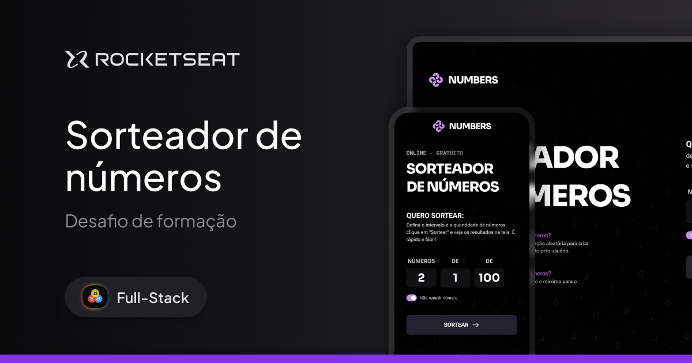

<!-- title page -->
<h1 align="center"> Sorteador de Números</h1>

<!-- nav -->

  <a href="#-tecnologias">Tecnologias</a>&nbsp;&nbsp;&nbsp;|&nbsp;&nbsp;&nbsp;
  <a href="#-projeto">Projeto</a>&nbsp;&nbsp;&nbsp;|&nbsp;&nbsp;&nbsp;
  <a href="#-layout">Layout</a>

<!-- cover -->

  

## 🚀 Tecnologias
Esse projeto foi desenvolvido com as seguintes tecnologias:

- HTML semântico e acessível
- CSS moderno
- JavaScript (DOM, eventos, lógica de sorteio)
- Git e GitHub

 

## 💻 Projeto
O projeto <strong>Sorteador de números</strong> é uma Landing Page interativa e responsiva, criada como parte da formação Full-Stack da [Rocketseat](https://www.rocketseat.com.br/).  

### Destaques técnicos:
- **HTML acessível e semântico**, com uso adequado de elementos como `fieldset`, `legend`, `label`, `aria-label` e atributos `lang` e `title`

- **CSS moderno**, com uso de:
  - CSS Grid e Flexbox
  - Funções como `clamp`, `calc`, `var`
  - Nesting, pseudo-elementos, transições e animações suaves
  - Arquitetura CSS baseada em módulos
- **JavaScript modular** com:
  - Manipulação de DOM
  - Lógica de sorteio com e sem repetição
  - Criação dinâmica de elementos com delay animado para exibição progressiva
- **Acessibilidade digital como base de desenvolvimento**

 

> [Navegue pela aplicação aqui](https://rkt-ffs-09-number-drawer.vercel.app/)

 

## 🔖 Layout
Desenvolvido por [Thiele Santana](https://www.linkedin.com/in/thielesantana), Product Designer na Rocketseat, você pode visualizar o layout do projeto através [desse link](https://www.figma.com/proto/WHQsznLcZB1G2kYcIzGnlv/Sorteador-de-n%C3%BAmeros--Community-?page-id=3%3A376&node-id=3275-553&viewport=-210%2C182%2C0.09&t=HhF6qcxJsLggHUeO-1&scaling=min-zoom&content-scaling=fixed&starting-point-node-id=3275%3A616&show-proto-sidebar=1).
